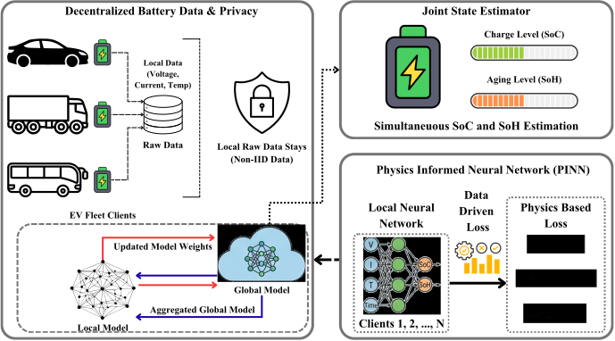

<h1>Physics-Informed Federated Learning with Interpretability: A Framework for Privacy-Preserving Joint SoC and SoH Estimation in Electric Vehicle Fleets</h1>

  

This experiment is on the <b>Battery Management System (BMS)</b>, where the estimation of <b>SoC (State of Charge)</b> and <b>SoH (State of Health)</b> is done using the integration of <b>Deep Learning (DL)</b> and <b>Physics Informed Neural Networks (PINNs)</b>. This experiment also ensures privacy using the concept of <b>Federated Learning (FL)</b>. So our contributions are listed below: 

1. This experiment proposes the first framework that ensures the privacy, a physics condition aware system for decentralized battery monitoring.

2. The embedding of physics equations into the federated loss functions, ensuring the consistency across diverse EVs.

3. Utilization of SHAP-Based local explanations to provide transparency which allows the verification that FL model is making decisions based on the original features rather than data noise.

4. Unlike previous approaches, our model performs simultaneuos joint estimation of SoC and SoH.

